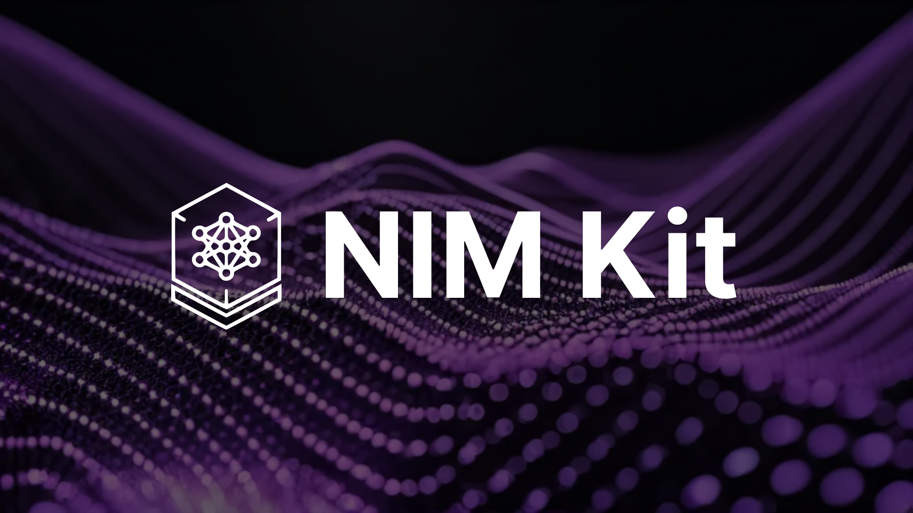

# NIM Kit

A toolkit to explore NVIDIA NIMs locally — from LLMs to 3D and beyond.

## Quick Start

1. **Start the backend services:**
   ```bash
   docker compose up
   ```

2. **Start the frontend development server:**
   ```bash
   cd frontend
   yarn && yarn dev
   ```

3. **Configure NVIDIA API (optional):**
   Copy `.env.sample` to `.env` and add your `NVIDIA_API_KEY` for enhanced functionality.

## Supported NIM Services

| Service Type | Model | Description |
|--------------|-------|-------------|
| **LLM** | Meta Llama 3.1 8B Instruct | Advanced language understanding and text generation |
| **LLM** | DeepSeek R1 Distill Llama 8B | Enhanced reasoning and coding capabilities |
| **Image Generation** | FLUX.1 Schnell | Fast, high-quality image generation |
| **Image Generation** | FLUX.1 Dev | State-of-the-art image generation suite |
| **Image Generation** | FLUX.1 Kontext Dev | Multimodal in-context image generation and editing |
| **3D Generation** | Microsoft Trellis | Generate 3D assets from text or images |
| **Speech Recognition** | NVIDIA Parakeet CTC 0.6B ASR | English speech-to-text transcription |
| **Speech Enhancement** | NVIDIA Studio Voice | Enhance speech quality and correct audio degradations |
| **OCR** | Baidu PaddleOCR | Optical character recognition and table extraction |

## Architecture

- **Backend**: FastAPI with Celery for async task processing
- **Frontend**: Nuxt.js with Vue 3, Tailwind CSS and shadcn-ui
- **Database**: Redis for caching and task queuing
- **Monitoring**: Flower for Celery task monitoring

## NIM Observability

Monitor your NIM deployments with built-in observability tools including Prometheus metrics, Grafana dashboards, and alerting rules. Navigate to the `nim-observability/` directory to set up comprehensive monitoring for your NIM services.